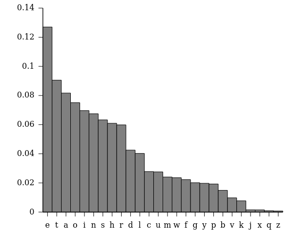
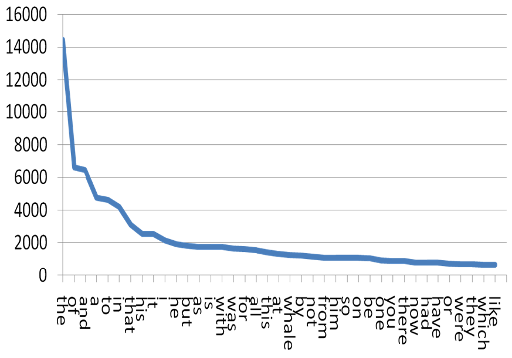

## Big picture

- [verbal] language is the main vehicle of human comunication

- until short ago, the main encoding of data/knowledge

. . .

- languages represent what we value and [seems to] determine what we __can__ think.

- universal grammars are studied.

-----

- complex grammars: a sign of affectation?

- terms are ambiguos __by design__

. . .

- the polar opposite of what data analytics needs!

-----

From the [British Medical Journal](http://www.bmj.com/content/360/bmj.k793):

__Organ specific immune-related adverse events are uncommon with anti-PD-1 drugs but the risk is increased compared with control treatments. General adverse events related to immune activation are largely similar. Adverse events consistent with musculoskeletal problems are inconsistently reported but adverse events may be common.__

-----

From [Men's Health](http://www.menshealth.co.uk/healthy/according-to-data-this-is-the-perfect-male-specimen):

__The stats don't lie... here's how to get the looks of her dreams__

__Love is in the eye of the beholder.__

__But good looks are down to science... sort of.__

__Ah, the chest. The part of the body most men would like to grow.
Luckily, you have come to the right place. We really do know a thing or two about building muscle.
Take your pick from the workouts below to stretch your chest.__

<!-- ----->
# From Text to numerical methods

## The occurrence matrix

Often text (document) analysis begins with word occurrence analysis: we record word usage irrespective of the position in text.

. . .

Let a document be a bag of words.
Let a corpus be a collection of documents.

. . .

The occurence matrix A:

$a_{ij} = k$

means that word $i$ appears $k$ times in document $j.$

-----

Word $i$ is represented by the $i$-th row of A (also $A^T_i$)

. . .

With row normalisation, word usage becomes a prob. distribution to which Entropy analysis can be applied.

With column norm., we analyse a document by its entropy.

<!-- --------------------->
#  Text Compression

## Example application: text compression

In languages, the occurrence of symbols is [statistically imbalanced](https://en.wikipedia.org/wiki/Letter_frequency):

Zipf's law: if the most frequent word appears k times, then the $i$-th word by freq. appears $\frac{k}{i}$ times.

-----

- low-frequency characters have high information entropy

- similarly, low-frequency words have high information entropy: __they tell more about the underlying topic of the document__

- A simpler application of Entropy is text compression

## Encoding compression

1. collect the frequencies of characters in a relevant __corpus__

A collection of documents taken to be representative of the target language

. . .

1. sort letters by their __increasing__ freq., e.g., for [English](https://en.wikipedia.org/wiki/Letter_frequency)

-----

Encoding compressed from $\log_2 27 \approx 4.75$ to $H[Pr[l_i]]\approx 4.22$

Further comp. by taking 2- and 3-grams: sequences of 2 or 3 characters.

The 3-gram __ent__ appears more often than __uzb.__

-----

1. encode the least frequent two as 0 and 1.

<table>
<tr>	
	<th>Char.</th>
	<th>Freq.</th>
	<th>Encoding</th>
</tr>
<tr>	
	<td>z</td>
	<td>.007</td>
	<td>0</td>
</tr>
<tr>	
	<td>q</td>
	<td>.009</td>
	<td>1</td>
</tr>
</table>

. . .

4. Prefix "1" to the existing codes; encode the third-least freq. letter as 0:

<table>
<tr>	
	<th>Char.</th>
	<th>Freq.</th>
	<th>Encoding</th>
</tr>
<tr>	
	<td>z</td>
	<td>.007</td>
	<td>10</td>
</tr>
<tr>	
	<td>q</td>
	<td>.009</td>
	<td>11</td>
</tr>
<tr>	
	<td>x</td>
	<td>.15</td>
	<td>0</td>
</tr>
</table>

-----

5. Prefix "1" to all; encode the fourth-least frequent letter as 0 again:

<table>
<tr>	
	<th>Char.</th>
	<th>Freq.</th>
	<th>Encoding</th>
</tr>
<tr>	
	<td>z</td>
	<td>.007</td>
	<td>110</td>
</tr>
<tr>	
	<td>q</td>
	<td>.009</td>
	<td>111</td>
</tr>
<tr>	
	<td>x</td>
	<td>.15</td>
	<td>10</td>
</tr>
<tr>	
	<td>j</td>
	<td>.153</td>
	<td>0</td>
</tr>
</table>

-----

5. finally...

<table>
<tr>	
	<th>Char.</th>
	<th>Freq.</th>
	<th>Encoding</th>
</tr>
<tr>	
	<td>z</td>
	<td>.007</td>
	<td>1...10</td>
</tr>
<tr>	
	<td>...</td>
	<td>...</td>
	<td>...</td>
</tr>
<tr>	
	<td>t</td>
	<td>9.05</td>
	<td>10</td>
</tr>
<tr>	
	<td>e</td>
	<td>12.72</td>
	<td>0</td>
</tr>
</table>

<!-- -->
## Application: text compression

[Huffmann algorithm](https://en.wikipedia.org/wiki/Huffman_coding): frequency-based letter encoding

- Optimal wrt. the theoretical lower-bound H.

- coding is __prefix-free:__ no code is the prefix of another

- __greedy__ algorithm: cost grows with $n\log n$

<!-- -------------------------------- -->
# Information Retrieval

## Definition

Instance:

- a collection of N documents

- a query ([set of ]keyword[s])

. . .

Solution:

- a selection of the documents ranked by their importance wrt. the keyword[s]

. . .

text documents

keyword-based ranking (doc. is a __bag of words)__

## Stopwords

## Term frequency (TF)

Rank documents on the basis of the frequence of the keyword in each

. . .

Euristics: At same frequency, choose those where the keyword appears __earlier__

. . .

For low-frequency (high-Entropy) terms simple relative frequencies work: eliminate __stopwords__

$TF(q_i, d_j) = \frac{|q_i\in d_j|}{MAX{|q_x\in d_j}|}$

## Inverted Doc. Freq. (IDF)

A query term $q_i$ is __specific__ in inverse relation to the number of documents in which it occurs

. . .

N documents, $n(q_i)$ of which contain $q_i$.

. . .

$$IDF(q_i) = \log \frac{N}{n(q_i)}$$

## TF-IDF

The standard __empirical__ measure for IR ranking

$$TFIDF(q_i, d_j, C) = TF(q_i, d_j) \cdot IDF(q_i, C)$$

. . .

For frequent terms (after stopwords)
we can _smooth_ $IDF(q_i, C)$ to $\log (1+ \frac{N}{n(q_i)})$

## Advanced tools

- Part-of-speech recognition (POS)

the context and its frequency guides the labelling of __words__.

. . .

- Named-Entity recognition (NER)

- follows POS

- A group of words are recognized as __naming__ a worldy object or a stand-alone concept.
