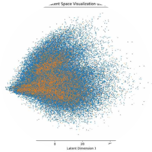

# Part I: Foundations of Generative Modeling {background-color="#0d1b2a"}

## Discriminative vs Generative

> Generative models aim to learn the **joint probability distribution** of data,
> whereas discriminative models learn conditional boundaries.

:::: {.columns}

::: {.column width="50%"}
### Discriminative
Maps high-dimensional input to a discrete label.

Optimises $P(Y \mid X)$.
:::

::: {.column width="50%"}
### Generative
Models how data was generated. 
Can generate new $X$ given $Y$ (conditional)
or just $X$ (unconditional).

$P_{\text{joint}}(X, Y) = P(X \mid Y)\,P(Y)$

$\quad X \sim P_{\text{data}}$
:::

::::

## Probabilistic Foundations

- **Sampling** — drawing from the learned manifold $P_{\text{data}}$.
- **Density Estimation** — explicitly modelling the likelihood $p(x)$.

Latent space visualisation: two class manifolds in a 2-D projection of
a learned embedding

{width=45%}

## The Transformer Architecture

> The paradigm shift from recurrent to **parallelisable** attention mechanisms
> (Vaswani et al., 2017).

:::: {.columns}

::: {.column width="55%"}
- **No Recurrence** — solves the vanishing-gradient problem in long sequences.
- **Positional Encoding** — injects sequential order via sinusoidal functions.
- **Architecture** — stacked **Encoder** (NLU) and **Decoder** (NLG) blocks.
:::

::: {.column width="45%"}
{width=90%}
:::

::::

## Attention Mechanism: The Core

> Mapping Query, Key, and Value vectors to compute **dynamic weightings**.

| Vector | Role |
|--------|------|
| **Query (Q)** | Represents the token *currently seeking context* from others. |
| **Key (K)** | "Index" vector used to calculate relevance (similarity) with the Query. |
| **Value (V)** | Content vector *aggregated* based on the attention weights. |

$$\text{Attention}(Q, K, V) = \text{softmax}\!\left(\frac{QK^\top}{\sqrt{d_k}}\right) V$$

## Stages of LLM Development

> **Scaling Laws** — performance follows a power law relative to
> Compute $C$, Data $D$, and Parameters $N$.

| Stage | Description |
|-------|-------------|
| **Pre-training** | Next-token prediction on trillions of tokens. Self-supervised learning. |
| **SFT** | Supervised Fine-Tuning on instruction–response pairs. |
| **RLHF** | Proximal Policy Optimisation (PPO) using a Reward Model. |
| **DPO** | Direct Preference Optimisation for alignment without RL complexity. |

## Parameter-Efficient Fine-Tuning (LoRA)

> **LoRA** (Low-Rank Adaptation) freezes the original weights and injects
> trainable rank-decomposition matrices.

:::: {.columns}

::: {.column width="55%"}
- Reduces trainable parameters by **10,000×**.
- Minimal VRAM overhead (**QLoRA**: 4-bit quantisation).
- **No inference latency** — adapted weights are merged at deployment.

$$h = W_0\,x + \Delta W\,x = W_0\,x + B A\,x$$

where $B \in \mathbb{R}^{d \times r}$, $A \in \mathbb{R}^{r \times d}$, rank $r \ll d$.
:::

::: {.column width="45%"}
{width=85%}
:::

::::

# Part II: Vision & Diffusion {background-color="#0a2240"}

## Beyond Autoregressive Modeling

---

## Diffusion Mechanics

> Diffusion models generate data by **reversing a Markov chain** that slowly
> adds Gaussian noise to the input.

:::: {.columns}

::: {.column width="55%"}
**Key Components**

- **Forward Process** — adds Gaussian noise step by step until
  $q(x_T) \approx \mathcal{N}(0, I)$.
- **Reverse Process** — a U-Net learns to predict and subtract noise at
  each step.
- Optimised via **Denoising Score Matching**.
:::

::: {.column width="45%"}
{width=100%}
:::

::::

## Variational Autoencoders (VAEs)

> Learning a **probabilistic latent space** by maximising the
> Evidence Lower BOund (ELBO).

$$\text{ELBO} = \mathbb{E}_{q_\phi(z|x)}\!\left[\log p_\theta(x \mid z)\right]
  - D_{\text{KL}}\!\left(q_\phi(z \mid x) \;\|\; p(z)\right)$$

The **KL-divergence** term acts as a regulariser, forcing the latent
distribution to stay near a standard Normal prior $p(z) = \mathcal{N}(0, I)$.

**Reparameterisation Trick** — to enable backpropagation through stochastic nodes:

$$z = \mu + \varepsilon \cdot \sigma, \qquad \varepsilon \sim \mathcal{N}(0, I)$$

## Multimodal Alignment: CLIP

> **CLIP** (Radford et al., 2021) — Contrastive Language-Image Pre-training
> aligns images and captions in a **shared embedding space**.

:::: {.columns}

::: {.column width="50%"}
- **Contrastive Loss** — maximise cosine similarity for $N$ correct
  image–caption pairs; minimise it for the $N^2 - N$ incorrect pairs.
- **Foundation** — enables zero-shot image classification and guides
  Stable Diffusion via text prompts.
:::

::: {.column width="50%"}
{width=100%}
:::

::::

## Research Frontiers

**Next Step:** Agentic Workflows and Tool-use (ReAct / Toolformer).

| Area | Description |
|------|-------------|
| **Interpretability** | Mechanistic interpretability: reverse-engineering weights into human-understandable circuits. |
| **Long Context** | Ring Attention and Linear Attention variants to process millions of tokens ($\mathcal{O}(N)$ complexity). |
| **Safety & Jailbreaking** | Adversarial robustness and Constitutional AI for alignment and refusal mechanics. |
