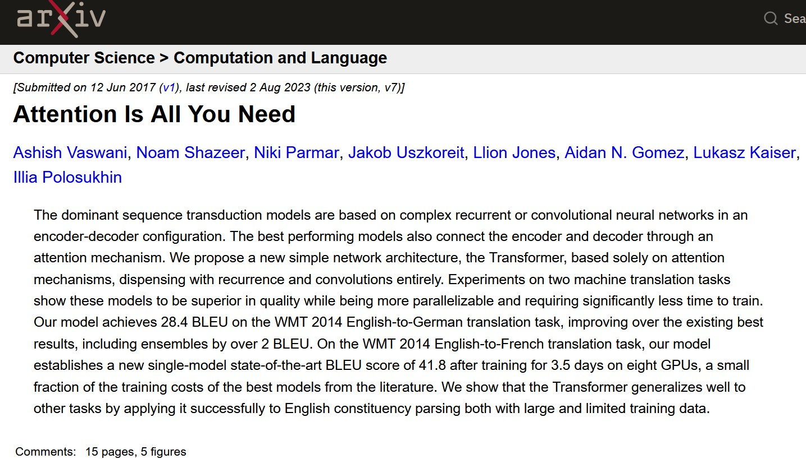

## Introduction

A relatively recent idea: 

- map words into points of a *magical* Cartesian space
- apply concepts and knowledge from Geometry/Linear algebra
- obtain inference: complete sentences or find the masked word

$v(\textbf{King}) = [0, 0, 0.11, 0, 0.67, 0 \dots ]$

. . .

$v(\textbf{King}) - v(\textbf{Male}) +  v(\textbf{Female}) \approx  v(\textbf{Queen})$

---

## Roadmap

1. **Word vectorization** — turning words into numbers
2. **Encoder / decoder** — turning a whole sentence into another sentence
3. **Attention** — letting the model "look back" at the right words

#  Word Vectorization {background-color="#2E7D6B"}

-----

## The naive approach: one-hot encoding

Each word in the dictionary is a dimension. 

- Vocabulary of 50,000 words → vectorial space of 50,000 dimensions
- Exactly one number is `1`, all the rest are `0`

. . .

Enormous spatial representation, even after stemming (swim/swam/swimming/swimmer → $v(\textbf{Swim})$)

Uniform word distances:  $d(v(\textbf{Cat}), v(\textbf{Kitten})) = d(v(\textbf{Cat}), v(\textbf{Tiger}))$?

## From sparse to dense

{fig-align="center" width="95%"}

## Word embeddings

Map all words in a low-dimensional space (could run up to 1000) to be *learned* via *training*

distance becomes meaningful: closeness = similarity of meaning

## Visualizing the space

{fig-align="center" width="80%"}

by processing many instances of *King* and *Queen* in same/similar contexts, the vectorisation mapping *learns* that the two are related. 

This is a form of __training__

## Vector arithmetic

Because meaning is encoded as direction and distance, you can literally do
**arithmetic with words**:

$v(\textbf{King}) - v(\textbf{Male}) +  v(\textbf{Female}) \approx  v(\textbf{Queen})$

{fig-align="center" width="72%"}

## Weight convergence

Vectorisation software, e.g., **Word2Vec** learns embeddings by trying to improve its score on a simple
guessing game, but millions of times:

::: {.fragment}
**"Given the words around a blank, guess the missing word from the actual text."**
:::

::: {.fragment}
the vectoriser is forced to notice that "cat" and
"kitten" fit in similar blanks — and gradually pushes their vectors closer
together.
:::

## Summary

- words become **vectors** in a hyperspace
- similar meaning → similar vectors → nearby points in space
- word meanings are now a geometric fact
- a v. only handles **individual words,** what about whole sentences?

- examples:  **Word2Vec** and **GloVe**

---

# 2. Encoder / Decoder {background-color="#B5482B"}

## From words to sentences

After word vectorization, a new topic:

> How can a software process a **whole sentence** and produce a **whole
> different sentence** — like translating English to Italian, or
> summarizing a paragraph?

the **encoder–decoder** architecture

## The two halves

::: columns
::: {.column width="50%"}
### Encoder
Reads the entire input, one word at a time, and compresses everything it
has read into a single summary.
:::

::: {.column width="50%"}
### Decoder
Starts from that summary and generates the output, one word at a time,
each new word informed by the ones it already produced.
:::
:::

## The E/D architecture

{fig-align="center" width="100%"}

## The context vector

Everything the encoder learns about the input sentence is mapped into a
 fixed-size vector — often called the **context vector** or "thought vector."

- the encoder *summarises* the whole sentence, including its order, into the context vector.
  sentence

- The decoder never sees the original words again — only the context vector

- the context vector is a representation that is *abstract* from both Italian and English

- limitation: the decoder has no access to the original words/sentence

## The bottleneck effect

- a short sentence is likely to described a single concept: E/D is able to recognise and translate it

- short sentences carry too much information for the fixed-size context vector

- encoder–decoder translation quality drops as sentences got longer

Imagine reading a 40-word sentence, then closing the book and having to
translate it from memory of **one single mental snapshot**.

What if the D. would **look back** at specific input words to adjust its translation?

---

# The Attention Mechanism {background-color="#C79A2E"}

## The fix: stop forcing everything through one summary

Instead of relying only on the final context vector, **attention** lets the
decoder look back at *every* word of the input, every time it generates a
new output word — and decide **which ones matter most for translation at hand**

- such information might come from words that are distant from the sentence being translated, or even past the sentence

::: {.fragment}
Analogy: instead of translating from a single memorized summary, keep
the original sentence in front and glance back at the relevant part
each time you write the next word.
:::

## How it works, conceptually

For every word the decoder is about to produce, attention:

1. Compares the decoder's current state to **every** input word
2. Assigns each input word a **relevance score** — how useful is this word
   right now?
3. Turns those scores into weights that add up to 1 (a probability
   distribution)
4. Builds a **custom summary**, weighted toward the most relevant input
   words, and uses it to produce the next output word

## Attention in action

{fig-align="center" width="100%"}

To translate "sat," the attention model pays most attention
to "sat" in the input — with a little attention on "cat" for grammatical
agreement, and almost none on the rest

## Seeing the weights directly

Attention weights can be visualized as a grid: one row per output word, one
column per input word, brightness = how much attention was paid.

{fig-align="center" width="62%"}

A fixed, word-by-word translation would correspond to the unit ('eye') matrix

## Observations

- **No more single bottleneck** — the decoder has access to the *entire*
  input at every step, not just the fixed summary (context) vector
- **Much better on long sentences** — relevant words that are distant in the text are not compressed into the context vector
- **Interpretability** — attention weights give a rough picture of
  *what the model is "looking at"*

## Attention is all you need

- for large-scale attention training, encoder/decoder is not needed anymore 
- a. **selectively focus** on the most relevant parts of the
  input for each part of the output
- Solves the bottleneck problem of plain encoder–decoder models
- less intriguing than E/D but more interpretable

---

# Putting it all together {background-color="#2E3A46"}

## The three ideas, connected

| Idea | Question it answers | Key limitation it solves |
|---|---|---|
| **Word vectorization** | How do we represent a *word* as numbers? | Raw text isn't numeric; one-hot vectors ignore similarity |
| **Encoder / decoder** | How do we turn a *sentence* into another sentence? | Individual word vectors alone don't capture sequence meaning |
| **Attention** | Which *parts* of the input matter for each part of the output? | Fixed-size summaries lose information on long inputs |

## In one picture

1. **Vectorization** embeds words into hyper-dimensional spaces: Geometry applies
2. **Encoder/decoder** sentences are mapped into/out of a latent space

3. **Attention** lets the decoder inspect the lexical context, both before and after the word in consideration

::: {.fragment}
Chatbots, and most "AI language models." are attention
:::

