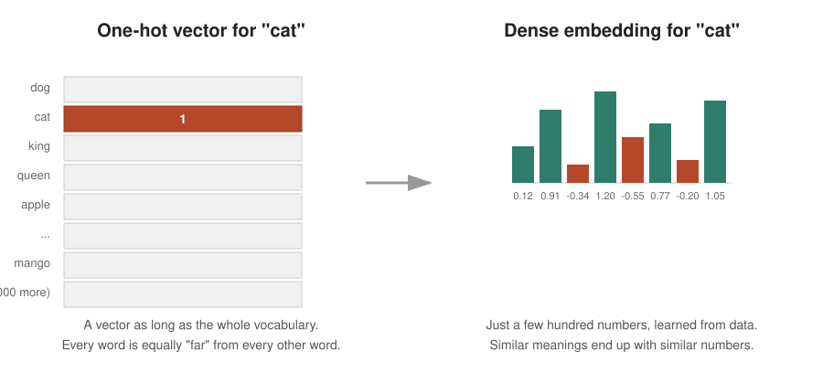
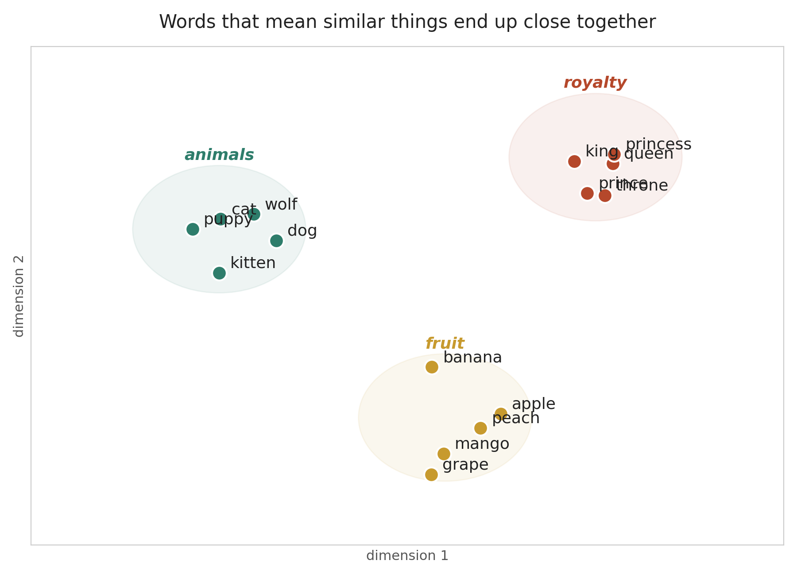
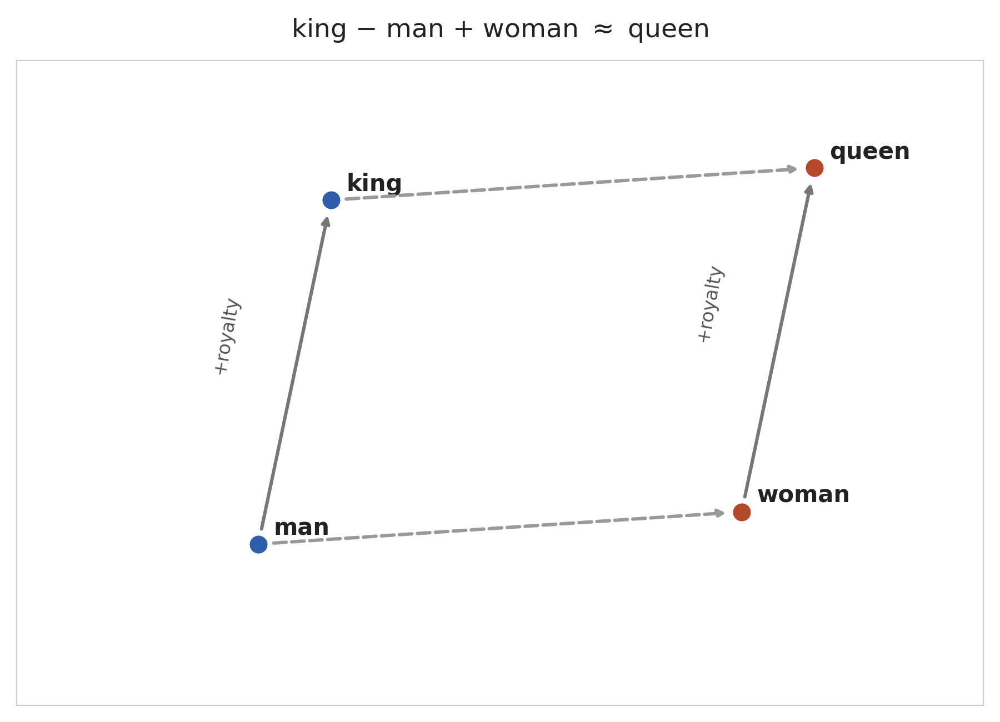
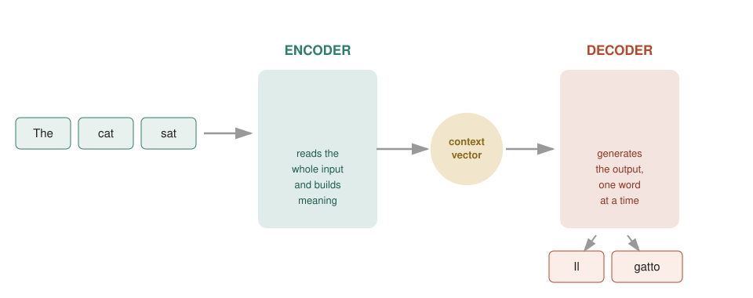
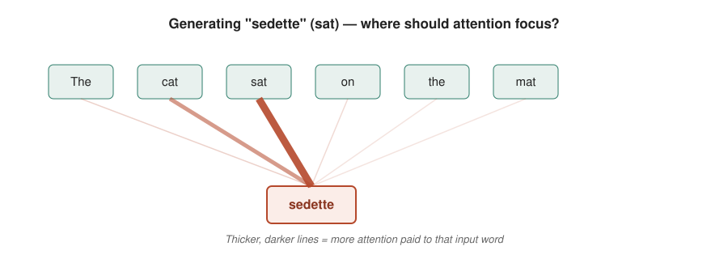
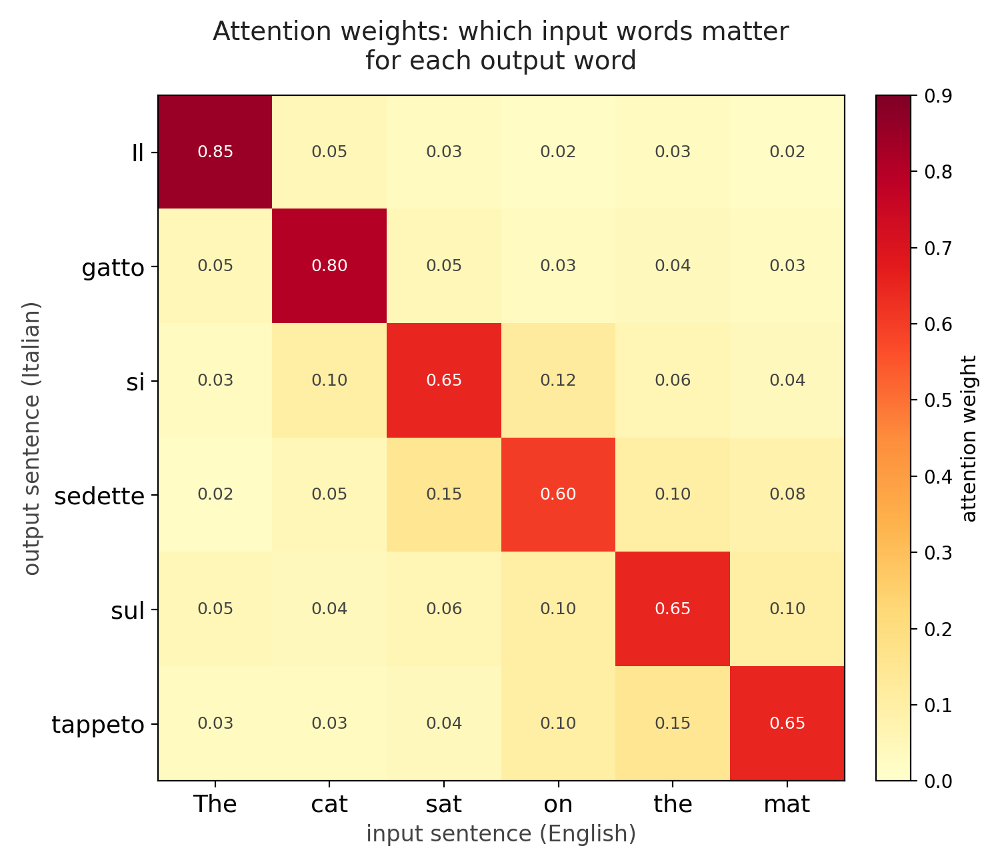

## Introduction

A relatively recent idea: 

- map words into points of a *magical* Cartesian space
- apply concepts and knowledge from Geometry/Linear algebra
- obtain inference: complete sentences or find the masked word

$v(\textbf{King}) = [0, 0, 0.11, 0, 0.67, 0 \dots ]$

. . .

$v(\textbf{King}) - v(\textbf{Male}) +  v(\textbf{Female}) \approx  v(\textbf{Queen})$

---

## Roadmap

1. **Word vectorization** — turning words into numbers
2. **Encoder / decoder** — turning a whole sentence into another sentence
3. **Attention** — letting the model "look back" at the right words

#  Word Vectorization {background-color="#2E7D6B"}

-----

## The naive approach: one-hot encoding

Each word in the dictionary is a dimension. 

- Vocabulary of 50,000 words → vectorial space of 50,000 dimensions
- Exactly one number is `1`, all the rest are `0`

. . .

Enormous spatial representation, even after stemming (swim/swam/swimming/swimmer → $v(\textbf{Swim})$)

Uniform word distances:  $d(v(\textbf{Cat}), v(\textbf{Kitten})) = d(v(\textbf{Cat}), v(\textbf{Tiger}))$?

## From sparse to dense

{fig-align="center" width="95%"}

## Word embeddings

Map all words in a low-dimensional space (b. 100 to 1000) to be *learned* via *training*

distance becomes meaningful: closeness = similarity of meaning

## Visualizing the space

{fig-align="center" width="80%"}

Words about the same topic naturally cluster together — nobody told the
model that "king" and "queen" are related. It figured that out from how
these words are *used* in text.

## The famous example: vector arithmetic

Because meaning is encoded as direction and distance, you can literally do
**arithmetic with words**:

$$\text{king} - \text{man} + \text{woman} \approx \text{queen}$$

{fig-align="center" width="72%"}

## Where do these numbers come from?

You never hand-design them. A model (famous examples: **Word2Vec**,
**GloVe**, and later contextual methods) learns embeddings by playing a
simple game millions of times over huge amounts of text:

::: {.fragment}
**"Given the words around a blank, guess the missing word."**
:::

::: {.fragment}
To get good at this game, the model is forced to notice that "cat" and
"dog" fit in similar blanks — and gradually pushes their vectors closer
together.
:::

## Takeaway — Word Vectorization

- Words become **vectors**: short lists of numbers
- Similar meaning → similar vectors → nearby points in space
- This turns "understanding language" into "doing geometry" — something
  computers are very good at
- But this only handles **individual words**. What about whole sentences?

---

# 2. Encoder / Decoder {background-color="#B5482B"}

## From words to sentences

Once each word is a vector, a new question appears:

> How does a model read a **whole sentence** and produce a **whole
> different sentence** — like translating English to Italian, or
> summarizing a paragraph?

The answer that dominated the field for several years: the
**encoder–decoder** architecture.

## The two halves

::: columns
::: {.column width="50%"}
### Encoder
Reads the entire input, one word at a time, and compresses everything it
has read into a single summary.
:::

::: {.column width="50%"}
### Decoder
Starts from that summary and generates the output, one word at a time,
each new word informed by the ones it already produced.
:::
:::

## The architecture

{fig-align="center" width="100%"}

## The context vector

Everything the encoder learns about the input sentence gets squeezed into
**one fixed-size vector** — often called the **context vector** or
"thought vector."

- Think of it as the encoder's best attempt at a **summary** of the whole
  sentence
- The decoder never sees the original words again — only this summary

::: {.fragment}
This is elegant... but it is also the architecture's biggest weakness.
:::

## The bottleneck problem

Imagine reading a 40-word sentence, then closing the book and having to
translate it from memory of **one single mental snapshot**.

::: {.fragment}
- Short sentences: fine
- Long sentences: information gets lost — the summary is simply too small
  to hold everything
:::

::: {.fragment}
This is exactly what researchers observed: encoder–decoder translation
quality dropped sharply as sentences got longer.
:::

## Takeaway — Encoder / Decoder

- **Encoder**: reads input → produces a compressed summary
- **Decoder**: unpacks that summary into the output, word by word
- Works well for short sequences
- Struggles with long ones — because everything is forced through a single
  fixed-size bottleneck
- We need a way for the decoder to **look back** at specific input words
  instead of relying only on the summary

---

# 3. The Attention Mechanism {background-color="#C79A2E"}

## The fix: stop forcing everything through one summary

Instead of relying only on the final context vector, **attention** lets the
decoder look back at *every* word of the input, every time it generates a
new output word — and decide **which ones matter right now**.

::: {.fragment}
Analogy: instead of translating from a single memorized summary, you keep
the original sentence in front of you and glance back at the relevant part
each time you write the next word.
:::

## How it works, conceptually

For every word the decoder is about to produce, attention:

1. Compares the decoder's current state to **every** input word
2. Assigns each input word a **relevance score** — how useful is this word
   right now?
3. Turns those scores into weights that add up to 1 (a probability
   distribution)
4. Builds a **custom summary**, weighted toward the most relevant input
   words, and uses it to produce the next output word

## Attention in action

{fig-align="center" width="100%"}

When producing the Italian word for "sat," the model pays most attention
to "sat" in the input — with a little attention on "cat" for grammatical
agreement, and almost none on the rest.

## Seeing the weights directly

Attention weights can be visualized as a grid: one row per output word, one
column per input word, brightness = how much attention was paid.

{fig-align="center" width="62%"}

Notice the pattern roughly follows the diagonal — each output word mostly
attends to the corresponding input word — but not always: word order can
differ between languages.

## Why this matters

- **No more single bottleneck** — the decoder has access to the *entire*
  input at every step, not just one fixed summary
- **Much better on long sentences** — relevant information doesn't have to
  survive a single compression step
- **Interpretability bonus** — attention weights give a rough picture of
  *what the model is "looking at"*, which is part of why they became
  popular for understanding model behavior

::: {.fragment}
Attention turned out to be so useful that researchers eventually asked:
*"What if attention is all we need — no encoder/decoder recurrence
required?"* That question led to the **Transformer** architecture, which
powers most modern language models — a story for another day.
:::

## Takeaway — Attention

- Lets a model **selectively focus** on the most relevant parts of the
  input for each part of the output
- Solves the bottleneck problem of plain encoder–decoder models
- The foundation underneath modern large language models

---

# Putting it all together {background-color="#2E3A46"}

## The three ideas, connected

| Idea | Question it answers | Key limitation it solves |
|---|---|---|
| **Word vectorization** | How do we represent a *word* as numbers? | Raw text isn't numeric; one-hot vectors ignore similarity |
| **Encoder / decoder** | How do we turn a *sentence* into another sentence? | Individual word vectors alone don't capture sequence meaning |
| **Attention** | Which *parts* of the input matter for each part of the output? | Fixed-size summaries lose information on long inputs |

## In one picture

1. **Vectorization** gives words meaningful numbers
2. **Encoder/decoder** strings those numbers into full sentences, in and
   out
3. **Attention** lets the decoder focus on the right words at the right
   time, instead of relying on one compressed summary

::: {.fragment}
Together, these three ideas are the conceptual backbone behind machine
translation, chatbots, and most of what people currently call "AI language
models."
:::

## Questions?

Thank you!

::: {.fragment}
*Next steps, if you're curious:* look up **Word2Vec**, **the original
encoder–decoder translation paper (Sutskever et al., 2014)**, and
**"Attention Is All You Need" (Vaswani et al., 2017)** — the paper that
introduced the Transformer.
:::
