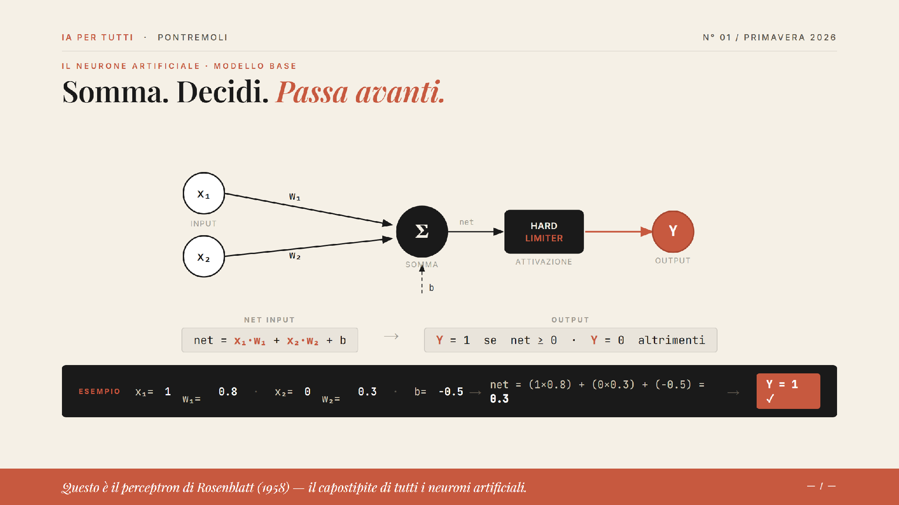
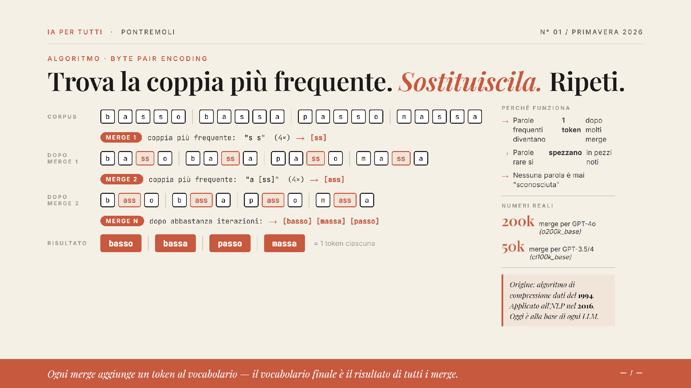
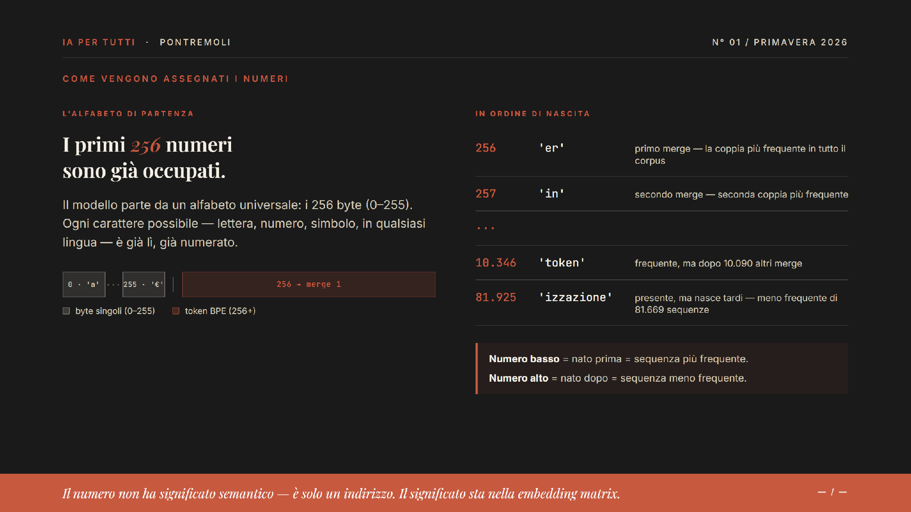
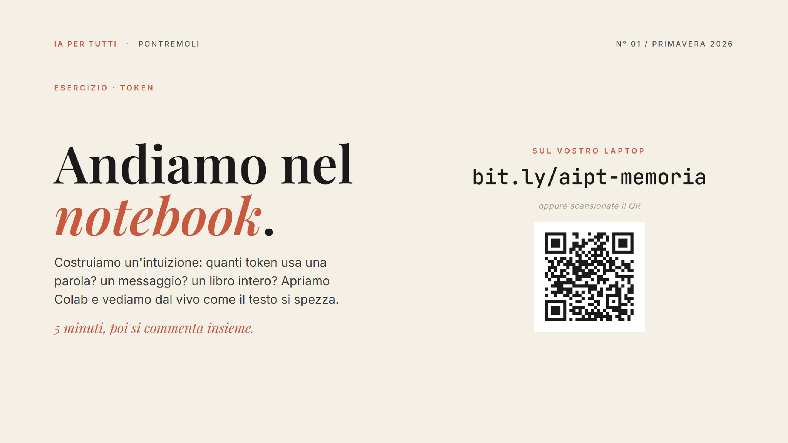

---
title: "AI4All: a gentle introduction to AI"
lang: en
author: GM, LP and AP
format:
  pdf:
    papersize: A4
    number-sections: true
    pdf-engine: pdflatex
  revealjs: 
    theme: solarized
    css: ../../styles/dsta_slides.css
    slide-number: true
    slide-level: 2
    # title-slide-attributes:
      # data-background-image: ../../styles/bbk-logo.svg
    code-fold: false
    echo: true
    # smaller: true
    scrollable: true
    fig-align: center
  html:
    toc: true
    code-fold: false
    anchor-sections: true
    other-links:
      - text: Class page
        href: https://github.com/ale66/learn-datascience
jupyter: python3
---

# AI4All {background-color="#1a1a1a"}

## AI4All

A lab to introduce the general public to current GenAI technology

Offered free to public libraries and cultural institutions

Gabriele Monti and Linda Petrini: idea, creating and execution

Alessandro Provetti: academic supervision


# THE MODEL {background-color="#1a1a1a"}

## A genius with amnesia.

:::: {.columns}
::: {.column width="33%"}
📚 **Enormous training**

Billions of texts, books, articles.
Frozen at a precise date.
:::
::: {.column width="33%"}
🌍 **No perception of the world**

It doesn't know whether it's raining outside.
It doesn't know who you are.
:::
::: {.column width="33%"}
💬 **Only explicit knowledge**

It knows what has been written.
It doesn't know what is lived.
:::
::::

> Polanyi (1966): *"We know more than we can tell."*
> The model knows only what has been written down.

---

# THE PARAMETERS {background-color="#1a1a1a"}

## The weights of the neural connections.

Just like synapses in the human brain, parameters are the weights of the connections between artificial neurons.

They are formed during training — then they are fixed.

Nobody can read a single parameter and understand what it means.

| Model | Parameters | Capability |
|---|---|---|
| Llama 3 8B | 8 billion | Simple tasks |
| Llama 3 70B | 70 billion | Advanced reasoning |
| GPT-4 (estimate) | ~1,800 billion | Complex analysis |

↑ *More parameters = more patterns absorbed from human language.*

> More parameters = more generic knowledge, frozen. But still without any perception of the real world.


# THE CONTEXT WINDOW  {background-color="#1a1a1a"}

## The conversation's working sheet.

> 1 token ≈ ¾ of a word  ·  "Artificial intelligence" ≈ 3 tokens

| Model | Context window | Approx. pages |
|---|---|---|
| GPT-3.5 | 16k tokens | ~12 pages |
| GPT-4o | 128k tokens | ~96 pages |
| Claude | 200k tokens | ~150 pages |
| Gemini 1.5 | 1M tokens | ~750 pages |

⚠️ **When the window is full → it forgets the oldest messages.**
Quantity ≠ attention.


# THE NEURAL NETWORK  {background-color="#1a1a1a"}

## Billions of nodes. Billions of connections. Every connection has a weight.

```
INPUT         HIDDEN 1      HIDDEN 2      HIDDEN 3      OUTPUT
(Text in)  →  [0.82]    →   [0.67]    →   [0.91]    →  [0.74]  → Response
           ↘              ↘              ↘
            [connections]  [connections]  [connections]
```

Training adjusts millions of weights until predictions become accurate.
Then the weights are **frozen forever**.


# THE ARTIFICIAL NEURON  {background-color="#1a1a1a"}

## Sum. Decide. *Pass it forward.*

{width=90%}

> This is Rosenblatt's perceptron (1958) — the ancestor of all artificial neurons.


# WHAT'S INSIDE A CHAT  {background-color="#1a1a1a"}

## Every message includes all of this.

| # | Component | Description |
|---|---|---|
| 01 | **System Prompt** | Who the model is, how it behaves, what its role is. Written by the chatbot's developer. |
| 02 | **Your Prompt** | Your question, your request. What you type right now. |
| 03 | **The Entire Prior Chat** | Every past message is re-injected at every turn. This is where context lives. |
| 04 | **Memory from Past Chats** | Often an automatic summary of previous conversations. |

> All of this enters the context window **together** with every single message.


# THE KEY  {background-color="#1a1a1a"}

## Context is the only thing you can control

:::: {.columns}
::: {.column width="45%"}
### PARAMETERS

- **Fixed** — you cannot touch them
- **Past** — frozen at training time
- **Opaque** — nobody can read them
:::
::: {.column width="10%"}
**VS**
:::
::: {.column width="45%"}
### CONTEXT

- **Dynamic** — changes with every chat
- **Present** — it is right now
- **Yours** — you write it
:::
::::


# MODULE 2 — AI and Memory {background-color="#1a1a1a"}


## AI and *Memory*

How an AI model *remembers* (and forgets).

**Linda Petrini · 20 May 2026**

---

## How many tokens in *"Hello, how are you?"*

## And in the entire *Divine Comedy?*

> — Guess. Then we'll look at it together.

::: {.callout-note}
The model reads in tokens, not words. It's its unit of measurement.
:::

---

## TOKENS — 01 · The Unit of Measurement  {background-color="#1a1a1a"}

## A token is a *little piece* of a word.

> **Pontremoli** → `Pon` · `trem` · `oli`

The model doesn't read words. It reads tokens.
Common words = 1 token; rare ones break into pieces.

:::: {.columns}
::: {.column width="50%"}
**"Hello, how are you?"**

### ~5
tokens. A greeting.
:::
::: {.column width="50%"}
**The Divine Comedy**

### ~250,000
tokens. The entire poem.
:::
::::

> Today's AI context windows: between 128,000 and 1,000,000 tokens.

---

# ALGORITHM · BYTE PAIR ENCODING  {background-color="#1a1a1a"}

## Find the most frequent pair. *Replace it.* Repeat.

{width=95%}

---

# HOW NUMBERS ARE ASSIGNED  {background-color="#1a1a1a"}

## The first *256* numbers are already taken.

{width=90%}

---

# EXERCISE · TOKEN NOTEBOOK  {background-color="#1a1a1a"}

## Let's go to the *notebook*.

{width=85%}

*5 minutes, then we discuss together.*

---

# TOKENS — 02 · Tokens Cost Money  {background-color="#1a1a1a"}

## How much does *one token* cost?

| Model | Input · per million tokens | Output · per million tokens |
|---|---|---|
| Mistral Small 3 | $0.10 | $0.30 |
| GPT-5 Mini | $0.25 | $2.00 |
| Claude Haiku 4.5 | $1.00 | $5.00 |
| Gemini 3.1 Pro | $2.00 | $12.00 |
| Claude Sonnet 4.6 | $3.00 | $15.00 |
| Claude Opus 4.7 | $5.00 | $25.00 |

> Summarising the Divine Comedy? From 3 cents on Mistral Small to €1.40 on Claude Opus.

---

## THE TURNING POINT

Context runs out *fast.*
It's paid by the token.
To stop making the AI start from scratch
→ ***memory.***

> The model doesn't remember you. It's the chatbot that rewrites the context, every time.

---

# 03 · SYNTHESIS  {background-color="#1a1a1a"}

## *Three* types of memory. Same substance: text in context.

:::: {.columns}
::: {.column width="33%"}
**01**
### In-conversation
The chat itself, while it's open. Everything you've written is still there.

*empties at end of chat*
:::
::: {.column width="33%"}
**02**
### Automatic persistent
ChatGPT Memory, Claude, Le Chat, Gemini. The chatbot saves facts about you in a file.

*you curate it — it decides what to save*
:::
::: {.column width="33%"}
**03**
### External persistent
Projects, uploaded files, RAG. You decide what goes in. It doesn't leave your space.

*total control, more effort*
:::
::::

> Everything, without exception, is text that enters the context.

---

# KEY CONCEPT — Memory vs Retrieval  {background-color="#1a1a1a"}

*Memory* is what the AI holds in its head.
*Retrieval* is what it goes to look for when needed.

*They often work together.*

:::: {.columns}
::: {.column width="50%"}
**MEMORY**

*ChatGPT knows you're a freelancer — you told it so in March.*
:::
::: {.column width="50%"}
**RETRIEVAL**

*Claude goes searching through old chats, emails, or a file you uploaded.*
:::
::::

> Memory = you already know it. Retrieval = you go look for it now. Two different gestures.

---

# 04 · QUICK COMPARISON  {background-color="#1a1a1a"}

## The five big players *at a glance.*

| | Chat history | Persistent memory | Editable | Free tier | Chat search |
|---|---|---|---|---|---|
| **ChatGPT** | Yes | Yes, automatic | Yes *(Settings → Memory → Manage)* | Yes | Yes |
| **Claude** | Yes | Yes (recent) + Projects | Yes | Limited | Yes |
| **Le Chat** (Mistral) | Yes | Yes (Memories) | Partial *(not individually)* | Yes | Yes |
| **Gemini** | Yes | Yes (Saved info) | Yes | Varies by country | Partial |
| **HuggingChat** | Yes (threads) | No | N/A | Yes, open models | Yes |

> UIs change every season. The concept stays: there is always a file of facts.

---

# DEMO LIVE · 4 MIN  {background-color="#1a1a1a"}

## Let's see it *together.*

I open MY ChatGPT with my real memories.
We go into *Settings → Personalization → Memory → Manage.*
We read what the bot knows about me, add a fact, open a new chat, verify.

> What you see now, you'll do yourself in two minutes. Keep your laptop ready.

---

# EXERCISE · 6 MIN  {background-color="#1a1a1a"}

## Open your *memory.*

Laptop open, the chatbot you use most. Let's look at your memory notepad.

*Whoever finishes first → next slide.*

| # | Step | Detail |
|---|---|---|
| 01 | Open your favourite chatbot | ChatGPT, Claude, Gemini, Le Chat… |
| 02 | Ask: **"What do you know about me?"** | often a surprise |
| 03 | Add a deliberate fact | e.g. *"Remember that I love pesto."* |
| 04 | Open Settings → Memory | every app has its own path |
| 05 | Edit or delete a fact | your digital CV |
| 06 | Open a **new chat** and ask again "what do you know about me?" | verify |

> It's a text file. You read it, edit it, delete it. No magic.

---

# EXERCISE · IN PAIRS · 6 MIN  {background-color="#1a1a1a"}

## Become the *chatbot.*

In pairs. One tells, the other decides what to save.
At the end, two verification questions — what you didn't save, you've lost.

| # | Step | Detail |
|---|---|---|
| 01 | In pairs: one is A (user), one is B (chatbot). | |
| 02 | **3 min:** A talks about themselves — week, work, one complaint. | fluid, no lists |
| 03 | B takes notes: **max 5 facts.** | what you'd save to memory |
| 04 | A asks **2 specific questions** about details from the story. | |
| 05 | Check: does B have those details in the notes? | discuss what was noise and what should have been saved |

> Even AI companies haven't solved this well. Save too little = gaps. Save too much = noise.

---

# CLOSURE · IN PRACTICE  {background-color="#1a1a1a"}

## UIs *change.* The concept *stays.*

Everything a chatbot "remembers" is text that enters the context.
Curate it like you curate a CV.

:::: {.columns}
::: {.column width="33%"}
**Search, don't remember**

If the data is there (March chat, email, PDF), tell the bot to look for it. Retrieval beats memory.
:::
::: {.column width="33%"}
**"Remember that X" in chat**

Try it instead of writing by hand in settings. Often the bot writes better what it decided to save. Experiment.
:::
::: {.column width="33%"}
**Delete on the fly**

Three seconds to delete a wrong or old fact. No need to wait for a monthly clean-up.
:::
::::

> Memory is you, the one who tends it. It's your silent competitive advantage.

---

## — *The End* — {background-color="#1a1a1a"}

The model doesn't *remember* you.
It's the chatbot that rewrites the context, every time, *pretending* to remember.

> *Thank you. The memory is yours. Tend it well.*
